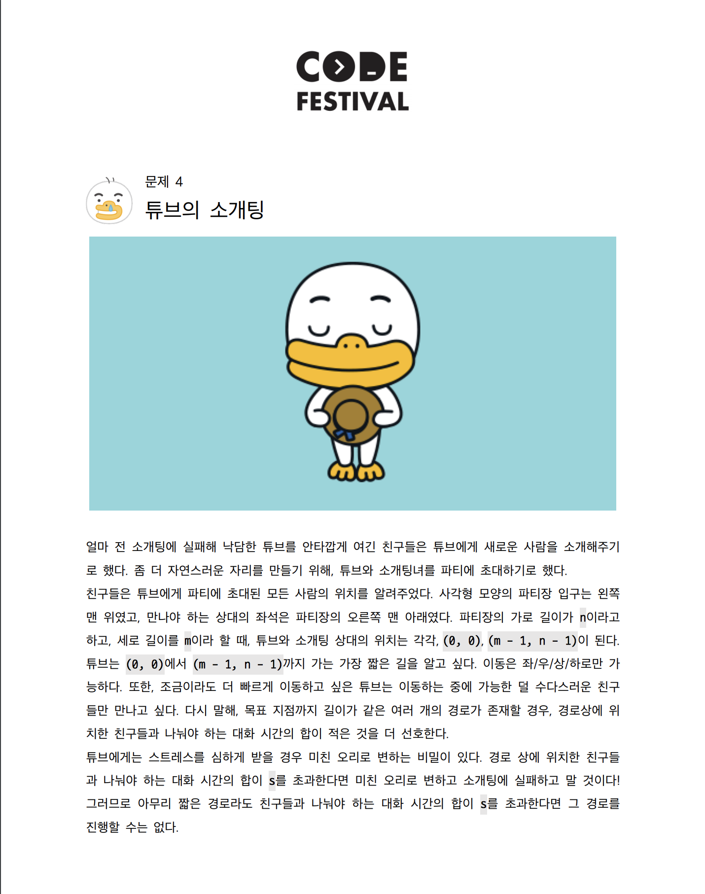
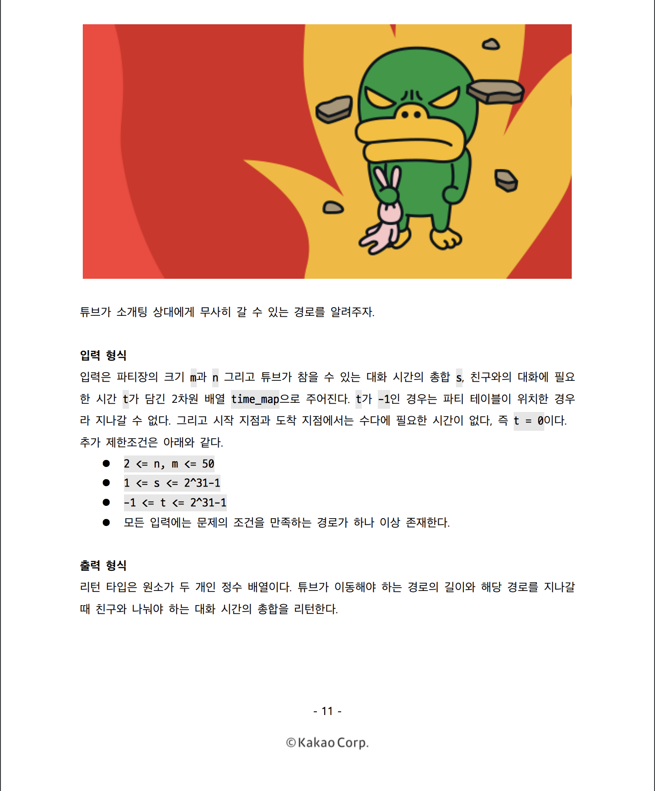
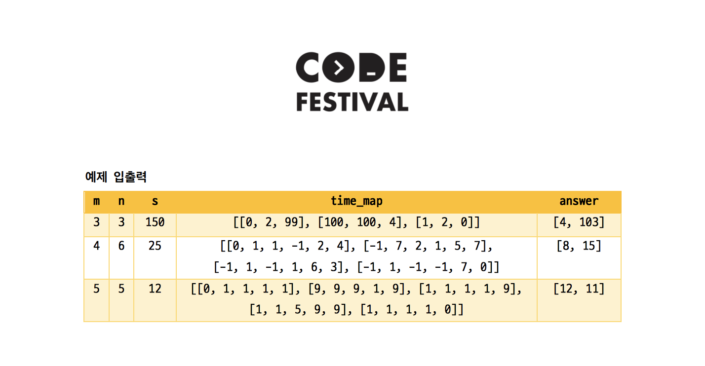

# 카카오 CodeFestival_본선_문제 4
(http://t1.kakaocdn.net/codefestival/problems.pdf)
(http://t1.kakaocdn.net/codefestival/problems.pdf)
(http://t1.kakaocdn.net/codefestival/problems.pdf)

## 문제 접근
2차원 배열이 주어질 때, 왼쪽 위에서 오른쪽 아래로 이동하면서 길이가 최소인 경로, 길이가 같다면 대화 시간의 합이 가장 작은 경로를 구하는 문제이다. **단, 총 대화 시간의 합은 입력된 `s` 를 넘지 않는다.** <br>
파티장의 상황은 `time_map` 2차원 배열로 주어지고, `time_map[i][j] == -1` 인 경우는 이동할 수 없는 경우이다. 
그 외의 경우는 `time_map[i][j]` 만큼의 비용을 지불하고(문제에서는 수다를 떨고) 지나갈 수 있다. <br>
<br>
일반적인 경로 탐색 알고리즘을 적용한다. <br>
출발점부터 i,j 까지 길이 k 로 가는 값을 `dist[k][i][j]` 로 정의한다.  
`dist[k][i][j]` 배열은 다익스트라 알고리즘으로 채워 나간다. <br>
기본적인 다익스트라 알고리즘 구현은 다음과 같다.  
```Java
class Element implements Comparable<Element> {
	private int index;
	private int dist;

	Element(int index, int dist) {
		this.index = index;
		this.dist = dist;
	}
	public int getIndex() {
		return this.index;
	}
	public int getDist() {
		return this.dist;
	}
	public int compareTo(Element o){
		if(distance<o.distance) {
			return -1;
		}else if(distance > o.distance) {
			return 1;
		}else {
			return 0;
		}
       // return distance <= o.distance ? -1 : 1;
    }
}

public static void dia(int nV,int start, int[] dist, int[][] ad) {

	for(int i=0; i<=nV; i++) {
		dist[i] = inf;
	}		

	PriorityQueue <Element> q = new <Element> PriorityQueue();
	dist[start] = 0;
	q.offer(new Element(start, dist[start]));

	while(!q.isEmpty()) {
		int cost = q.peek().getDist();
		int here = q.peek().getIndex();
		q.poll();

		if(cost > dist[here])
			continue;
		//방문했다.
		System.out.println(here);

		for(int i=0; i<=nV; i++) {
			if(ad[here][i] != 0 && dist[here] > dist[here] + ad[here][i]) {
				dist[i] = dist[here] + ad[here][i];
				q.offer(new Element(i, dist[i]));
			}
		}
	}
}
```
<br>
`Priority Queue` 를 사용하여, 큐에 넣는 순간 `dist` 오름차순 정렬되도록 한다.<br>
이를 위해, `compareTo` 메소드를 재정의 하여 사용하였다. <br>

4방향 탐색이 진행되어야 하므로, `for` 문과 `switch` 문을 추가하여 각 케이스 별로 새로운 경로를 탐색하고 이 값이 이전 값보다 작을 경우 업데이트 해주었다. <br>

<br>
## 유의해야 할 점.
이 문제 역시 `newX` , `newY` 값이 범위를 초과하면 안된다.<br>
m,n 을 초과하지 않는 지 검사하는 함수를 추가하고, 범위를 넘지 않을 경우만 다익스트라 알고리즘을 수행한다. <br>
```Java
...
if(!isRange(m,n,newX,newY)) continue;
if(time_map[newX][newY] == -1) continue;
if(dist[len+1][newX][newY] > dist[len][cur_x][cur_y] + time_map[newX][newY]) {
	dist[len+1][newX][newY] = dist[len][cur_x][cur_y] + time_map[newX][newY];
	q.offer(new Element(newX,newY,len+1));
}
...
private static boolean isRange(int m, int n, int x, int y) {
	return 0<=x && x<m && 0<=y && y<n;
}
```
<br>
<br>
탐색이 끝난 후, 문제에 지정된 시간 `s` 를 넘지 않으면서 거리가 최소가 되는 값을 찾아야 한다. <br>
`PrirorityQueue` 를 사용 하였으므로, s를 넘지않는 최초 값이 최소값임이 보장 된다. <br>
```Java
for(int k=0; k< n*m; k++) {
	if(dist[k][m-1][n-1] > s) continue;
	//Priority Queue를 사용하였으므로 찾기만 하면 바로 break;.
	move = k;
	talk = dist[k][m-1][n-1];
	break;
}
answer[0] = move;
answer[1] = talk;
return answer;
```

최종 코드는 아래와 같다. <br>
(너무 길어서 우선 링크로 거는데,, 보고서에 full code를 넣을지 상의 해보죠.) <br>
[acmicpc_note/DS/SY_kkao+boj/KCF1.java](url)
