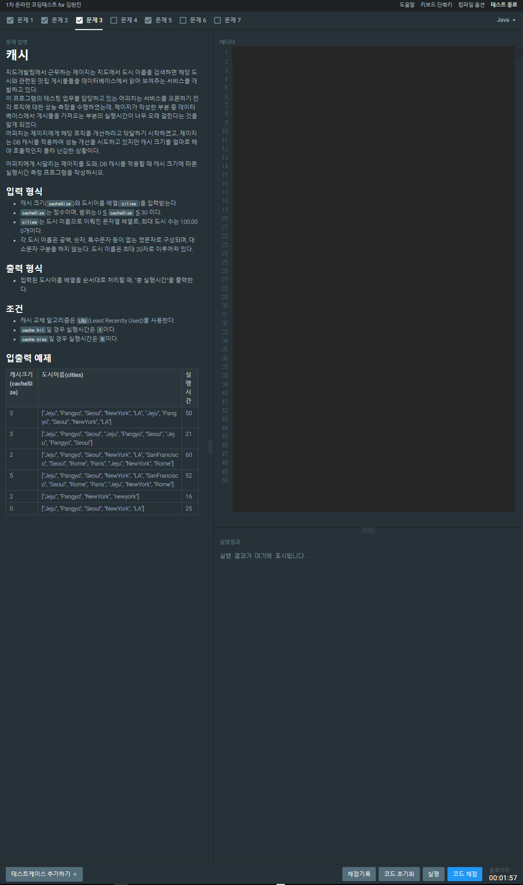

# 카카오 CodeFestival_예선_문제 3


## 문제 접근
문제를 잘 읽고 구현하면 된다. 특별한 알고리즘이 쓰이지 않았고, `Queue` 를 활용하여 `LRU` 상황을 구현하였다. <br>

```Java
import java.util.*;

public class KCF2 {
	public static int solution(int cacheSize, String[] cities) {
		//소요시간, 즉 정답.
		int time = 0;
		if(cacheSize==0) {
			return cities.length *5;
		}
		Queue<String> c = new LinkedList<String>();
		int index = 0;
		int citi_len = cities.length;
		boolean isHit = false;
		int cache_index = 0;

		//캐쉬부터 채우자.
		for(index=0; index<cacheSize; index++) {
			time += 5;
			c.add(cities[index]);
		}

		while(index < citi_len) {
			isHit = false;

			for(String tmp : c) {
				//Cache tmp = c.peek();
				if(cities[index].equals(tmp)) {
					//지우고 다시넣기.x
					//System.out.println(tmp.city);
					c.remove(tmp);
					c.add(tmp);
					isHit = true;
					break;
				}
			}
			if(isHit) {
				time++;
			}else {
				time += 5;
				c.poll();
				c.add(cities[index]);
			}
			index++;
		}
		return time;
	}

	public static void main (String[] args) throws Exception {
		String[] city1 = {"jeju" , "pangyo" , "soeul", "newyork", "la","jeju", "pangyo" ,"soeul" ,"newyork", "la"};
		String[] city2 = {"jeju" , "pangyo" , "soeul", "jeju", "pangyo","soeul", "jeju" ,"pangyo" ,"soeul"};
		String[] city3 = {"jeju" , "pangyo" , "newyork", "newyork"};
		System.out.println(solution(3, city1));
		System.out.println("============");
		System.out.println(solution(3, city2));
		System.out.println(solution(2, city3));
	}
}	
```