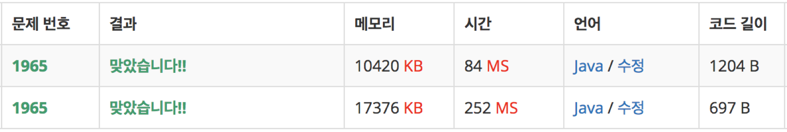

# 백준_1965_LIS+lowerBound
> https://www.acmicpc.net/problem/1965

## 문제 접근
숫자들을 조합하여 길이가 가장 긴 조합을 찾는 문제이므로, `LIS(Longest increasing Subsequence)` 알고리즘을 적용한다. <br>

다음과 같은 수열이 존재한다고 하자. <br> 
여기서 `LIS` 를 찾는다면, <br>

다음과 같이 빨간 부분으로 색칠된 부분이 `LIS` 이다.  
<br>
즉, 앞에서부터 뒤로 숫자를 선택하며 부분 수열을 구성해 나갈 때, **증가하는 순서대로 숫자를 고르면서** **부분 수열의 길이가 최대길이**
가 되도록 숫자를 선택하는 경우다.  <br>

가장 쉬운 구현은 `O(n^2)` 로 가능하다.  
```Java
// dp[x] : x번째 수를 마지막 원소로 가지는 LIS 의 길이. 
for (int i = 0; i < n; i++) {
    if (dp[i] == 0)dp[i] = 1;
    for (int j = 0; j < i; j++) {
        if (arr[i] > arr[j]) {
            if (dp[i] < dp[j] + 1) {
                dp[i] = dp[j] + 1;
            }
        }
    }
}
```
  

## 유의해야 할 점.
하지만 `N` 이 10만이 넘는다면 이 방법으로 문제를 해결할 수 없다.  
**이분 탐색** 을 이용해 본다.  
기본적으로 `O(n)` 의 방법으로 수열을 처음부터 확인하고, 이분탐색을 이용하여 `LIS` 를 유지하기 위한 최적의 위치에다가 수를 삽입한다.  
<br>
자리를 찾는 방법으로는 `lowerBound` 를 사용한다.  
찾고자 하는 수 `target` 이 주어질 때, `target` 보다 가장 가까운 큰 수의 index를 반환 한다.  
코드로 표현하면 다음과 같다.  
```Java
int lowerBound(int target) {
	int start = 0;
	int end = li.size();
	int mid = 0;

	while(end > start) {
		mid = (start+end) /2;
		if(li.get(mid) >= target) {
			end = mid;
		}else {
			start = mid+1;
		}
	}
	return end;
}
```

`start` 지점을 0, `end` 를 list 의 size로 설정한다.  
중간지점 `mid` 를 기준으로 `li.get(mid)`  값이 내가 찾고자 하는 target의 값보다 같거나 클 경우 end를 mid로 업데이트 한다.  
이 end는 target보다 가장 가까운 수의 index 후보이다.  
<br>
이 과정을 반복하다 보면, 탐색 범위는 점점 좁혀진다.  
`end > start` 의 조건을 만족하며 반복했을 때, 최종 end가 가장 가까운 큰 수의 위치이다.  
<br>
만약 가장 가까운 큰 수가 없을 시, end 는 `li.size()` 이므로 target 값은  리스트의 맨 뒷쪽에 삽입된다.  
<br>
`lowerBound` 를 적용한 최종 코드는 다음과 같고, 시간 복잡도는 `O(nlogn)` 이다.  

```Java
import java.util.*;
import java.io.BufferedReader;
import java.io.InputStreamReader;
import java.util.StringTokenizer;
//LIS 알고리즘.
public class B_1965 {
	static ArrayList<Integer> li;
	public static void main(String[] args) throws Exception {
		BufferedReader br = new BufferedReader(new InputStreamReader(System.in));
		int count = Integer.parseInt(br.readLine());

		int i;
		int szOfBox;
		int position;

		StringTokenizer st = new StringTokenizer(br.readLine());
		int[] box = new int[count];
		for(i=0; i<count; i++) {
			box[i] = Integer.parseInt(st.nextToken());
		}
		li = new ArrayList<>();

		for(i=0; i<count; i++) {
			szOfBox = box[i];
			position = lowerBound(szOfBox);
			if(position == li.size()) {
				li.add(szOfBox);
			}else {
				li.set(position,szOfBox);
			}
		}
		System.out.println(li.size());
	}
	//2분 탐색 + target 보다 큰수의 인덱스를 바로 리턴.
	static int lowerBound(int target) {
		int start = 0;
		int end = li.size();
		int mid = 0;

		while(end > start) {
			mid = (start+end) /2;
			if(li.get(mid) >= target) {
				end = mid;
				//break;
			}else {
				start = mid+1;
			}
		}
		return end;
	}
}
```
<br>
아래는 각각 `O(n^2)` 방법과 `O(nlogn)` 방법으로 풀었을 때의 속도 차이 이다.  
